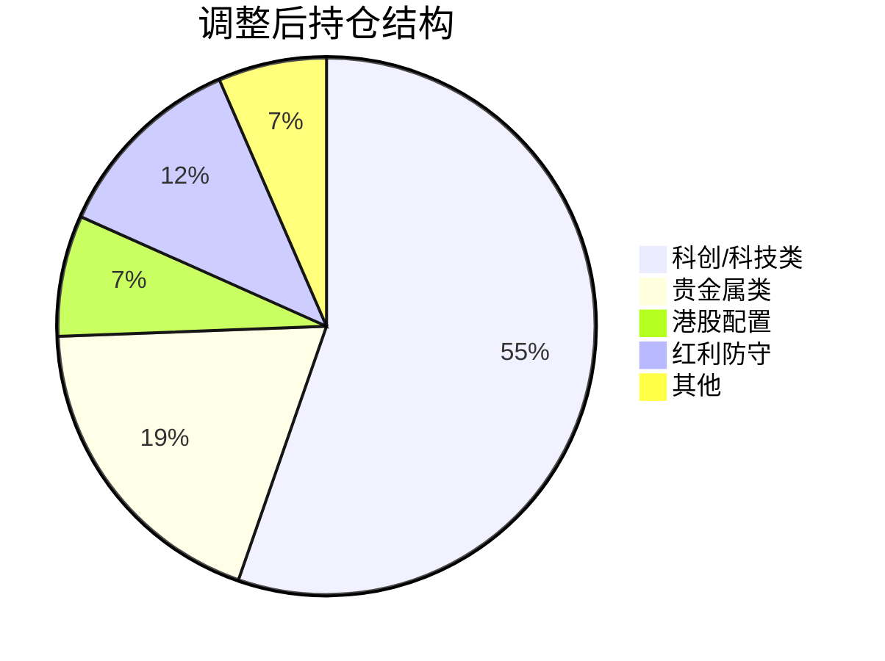

# 投资分析报告

**生成时间**: 2026-01-07 09:07:07

---

## 1. 市场概况与持仓分析

### 账户概况
| 项目 | 数值 |
|:---|---:|
| 总资产 | 93,054.46 元 |
| 持仓市值 | 25,029.50 元 |
| 可用资金 | 68,024.96 元 |
| 仓位比例 | 26.90% |
| 本次调仓预算 | ≤ 2,000 元 |

### 现有持仓技术诊断

整体来看，**所有持仓均处于多头趋势**，部分标的出现短期超买信号。

| 代码 | 名称 | 持仓 | 市值 | 盈亏 | RSI | 趋势 | 动量 | 诊断 |
|:---|:---|---:|---:|---:|---:|:---|:---|:---|
| 510880 | 红利ETF | 1000 | 3,180 | -26.00 | 57.15 | 多头 | 强 | ✅ 健康区间，可继续持有 |
| 515050 | 5GETF | 500 | 1,164 | 0.00 | 63.61 | 多头 | 弱 | ⚠️ 动量转弱，需观察 |
| 515070 | AI智能 | 500 | 1,003 | +6.50 | 67.06 | 多头 | 强 | ✅ 突破上轨，趋势良好 |
| 588000 | 科创50 | 8000 | 11,832 | +447.51 | 66.98 | 多头 | 强 | ✅ 主力持仓，趋势强劲 |
| 159516 | 半导体设备 | 1000 | 1,635 | +16.00 | **74.27** | 多头 | 强 | ⚠️ 接近超买，冲高减仓 |
| 159770 | 机器人AI | 1000 | 1,074 | +5.00 | 69.33 | 多头 | 强 | ✅ 偏高位但趋势完好 |
| 159830 | 上海金 | 400 | 3,956 | +66.70 | 60.87 | 多头 | 弱 | ✅ 避险配置，稳健 |
| 161226 | 白银基金 | 500 | 1,186 | +20.50 | 62.41 | 多头 | 弱 | ⚠️ 高波动，适度减持 |

> [!NOTE]
> **RSI 参考标准**: RSI < 30 为超卖区，RSI > 70 为超买区，30-70 为正常区间

---

## 2. 关注标的分析

### 用户拟建仓标的

| 代码 | 名称 | 价格 | RSI | 趋势 | 建议 |
|:---|:---|---:|---:|:---|:---|
| 159241 | 航空航天ETF天弘 | 1.462 | **82.31** | 多头 | ❌ **不建议现价建仓** |
| 513630 | 恒生科技指数ETF | 1.613 | 44.87 | 空头 | ⭕ 可小仓位试探 |
| 159691 | 港股红利指数ETF | 1.324 | 54.96 | 空头 | ⭕ 估值合理，可建仓 |

> [!WARNING]
> **159241 航空航天ETF** 当前 RSI 高达 82.31，已处于严重超买区域，价格突破布林带上轨 1.73%，短期追高风险极大。建议**等待回调至 RSI < 65 或价格回落至 1.35 附近再考虑建仓**。

> [!TIP]
> **513630 恒生科技** 和 **159691 港股红利** 属于港股配置，当前估值处于中低位，可作为分散配置的选择。恒生科技 RSI 仅 44.87，处于弱势区间但接近超卖，适合左侧小仓位布局。

---

## 3. 具体操作建议

### 策略总结
**基于 2,000 元预算限制，采用「适度减持超买标的 + 布局港股低估品种」策略**

---

### 🔴 减仓/卖出

| 代码 | 名称 | 操作 | 卖出价格区间 | 卖出数量 | 预估回笼资金 | 理由 |
|:---|:---|:---|:---:|---:|---:|:---|
| **159516** | 半导体设备 | 减持 | 1.68 - 1.72 | 300 股 | ~504 - 516 元 | RSI 74.27 接近超买，价格突破布林上轨 2.3%，锁定部分利润 |
| **161226** | 白银基金 | 减持 | 2.55 - 2.62 | 200 股 | ~510 - 524 元 | 近期涨幅高达 12.6%，动量转弱，高波动品种降低仓位 |

**减仓合计回笼**: 约 1,014 - 1,040 元

---

### 🟢 建仓/增持

| 代码 | 名称 | 操作 | 买入价格区间 | 买入数量 | 预估金额 | 理由 |
|:---|:---|:---|:---:|---:|---:|:---|
| **159691** | 港股红利指数ETF | 建仓 | 1.30 - 1.33 | 1000 股 | ~1,300 - 1,330 元 | RSI 54.96 健康区间，估值偏低，高股息策略作为避险配置，分散A股风险 |
| **513630** | 恒生科技指数ETF | 建仓 | 1.58 - 1.62 | 400 股 | ~632 - 648 元 | RSI 44.87 接近超卖，下跌趋势末端，小仓位左侧布局抄底 |

**建仓合计支出**: 约 1,932 - 1,978 元

---

### ⚠️ 暂不操作

| 代码 | 名称 | 理由 |
|:---|:---|:---|
| **159241** | 航空航天ETF天弘 | RSI 82.31 严重超买，追高风险极大，等待回调至 1.32-1.38 区间再建仓 |

---

## 4. 调整后展望

### 资金利用情况

| 项目 | 调整前 | 调整后 | 变化 |
|:---|---:|---:|---:|
| 持仓市值 | 25,029.50 元 | ~26,947 元 | +~1,918 元 |
| 持仓数量 | 8 只 | 10 只 | +2 只 |
| 仓位比例 | 26.90% | ~28.96% | +2.06% |

### 组合风格变化

- **新增港股配置**: 分散单一市场风险，增加海外敞口
- **降低高波动敞口**: 减持白银、半导体，锁定利润
- **保持核心持仓不变**: 科创50 作为主力，机器人AI、AI智能保持

### 风险提示

> [!CAUTION]
> 1. **科创50 (588000)** 持仓占比高达 47%，集中度风险较大，后续可考虑适度分散
> 2. **港股标的** 受外围市场影响较大，需关注美股及港股流动性风险
> 3. **航空航天ETF 159241** 若继续追涨可能面临 10-15% 的短期回调风险

### 止损建议

| 代码 | 名称 | 建议止损价 | 说明 |
|:---|:---|---:|:---|
| 159691 | 港股红利指数ETF | 1.26 | 跌破布林下轨 |
| 513630 | 恒生科技指数ETF | 1.55 | 跌破近期低点 |

---

## 5. 生成文件

- [analyze_portfolio.py](file:///Users/liupengcheng/Documents/Code/finance-analysis/quantitative-trading-skills/quantitative-trading/workspace/2026-01-07/090504/analyze_portfolio.py) - 分析脚本
- [analysis_result.json](file:///Users/liupengcheng/Documents/Code/finance-analysis/quantitative-trading-skills/quantitative-trading/workspace/2026-01-07/090504/analysis_result.json) - 技术指标数据

---

*注：以上分析基于技术指标与定量策略，仅供参考，不构成投资建议。市场有风险，投资需谨慎。*
