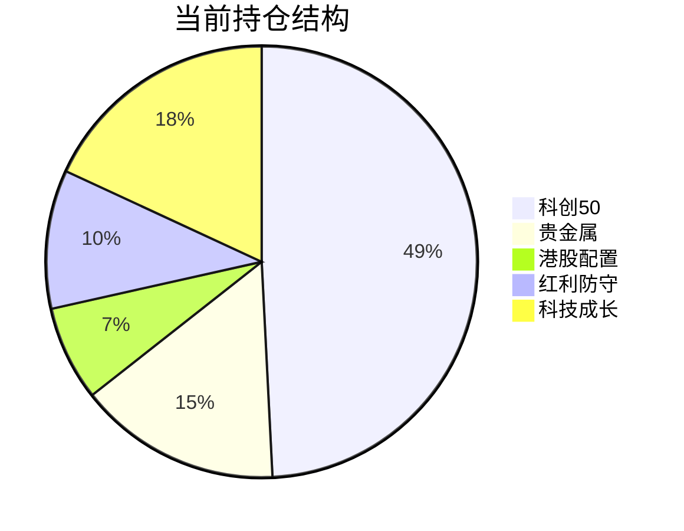

# 投资分析报告

**生成时间**: 2026-01-09 09:03:56

---

## 1. 市场概况与持仓分析

### 账户概况

| 项目         |         数值 |
| :----------- | -----------: |
| 持仓市值     | 31,097.60 元 |
| 持仓数量     |        11 只 |
| 本次分析日期 |   2026-01-09 |

### 现有持仓技术诊断

整体来看，**10只持仓处于多头趋势**，仅香港红利ETF (513630) 处于空头趋势。值得关注的是多只标的已进入超买或即将超买区间。

| 代码       | 名称           |      持仓 |       市值 |        盈亏 |       盈亏% |       RSI | 趋势     | 动量   | 诊断                             |
| :--------- | :------------- | --------: | ---------: | ----------: | ----------: | --------: | :------- | :----- | :------------------------------- |
| 510880     | 红利ETF        |      1000 |      3,221 |      +15.00 |      +0.48% |     56.56 | 多头     | 强     | ✅ 健康区间，防守型配置           |
| 512400     | 有色ETF        |      1000 |      2,032 |      +12.00 |      +0.62% |     69.30 | 多头     | 弱     | ⚠️ 接近超买，关注回调             |
| 513180     | 恒指科技       |       800 |        601 |      -14.60 |      -2.29% |     50.74 | 多头     | 弱     | ⭕ 中性区间，可持有观望           |
| **513630** | **香港红利**   |  **1000** |  **1,603** |  **-12.00** |  **-0.71%** | **41.83** | **空头** | **强** | ⚠️ 趋势偏弱，观察                 |
| 515050     | 5GETF          |       500 |      1,163 |       -1.50 |      -0.09% |     61.54 | 多头     | 弱     | ✅ 健康区间，动量弱需观察         |
| 515070     | AI智能         |       500 |      1,014 |      +17.50 |      +1.81% |     67.62 | 多头     | 强     | ✅ 动量强劲，趋势良好             |
| **588000** | **科创50**     | **10000** | **15,310** | **+962.83** |  **+6.72%** | **70.43** | **多头** | **强** | ⚠️ **超买临界点，主力仓位需警惕** |
| **159516** | **半导体设备** |   **200** |    **361** |  **+83.60** | **+30.37%** | **78.64** | **多头** | **强** | 🔴 **严重超买，强烈建议止盈**     |
| 159770     | 机器人AI       |      1000 |      1,079 |      +10.00 |      +0.98% |     67.64 | 多头     | 弱     | ✅ 偏高位，趋势完好               |
| 159830     | 上海金         |       400 |      3,965 |      +75.50 |      +1.95% |     57.58 | 多头     | 弱     | ✅ 避险配置，稳健                 |
| 161226     | 白银基金       |       300 |        750 |     +103.60 |     +16.12% |     58.74 | 多头     | 弱     | ⚠️ 涨幅大波动高，适度留意         |

> [!NOTE]
> **RSI 参考标准**: RSI < 30 为超卖区，RSI > 70 为超买区，30-70 为正常区间

---

## 2. 关注标的分析：航空航天ETF天弘 (159241)

### 技术指标一览

| 项目       |          数值 | 评价                     |
| :--------- | ------------: | :----------------------- |
| 当前价格   |      1.527 元 | 布林上轨: 1.503 (已突破) |
| RSI(14)    |     **83.97** | 🔴 严重超买               |
| 5日涨幅    |        +9.94% | 短期涨幅过大             |
| 20日涨幅   |       +26.51% | 中期趋势极强但透支       |
| 趋势状态   |          多头 | MACD 强势                |
| 布林带位置 | 突破上轨 1.6% | 极端超买信号             |

> [!CAUTION]
> **159241 航空航天ETF 不建议现价建仓！**
> 
> 当前RSI高达 **83.97**，比 1月6日报告时的 78.55 更加超买，价格已突破布林上轨。
> 
> **对比1月6日分析**：当时RSI为78.55，建议"等待回调至RSI < 65或价格回落至1.35附近"。目前价格不降反升（1.408 → 1.527，涨幅8.5%），超买程度加剧。
> 
> **建议**：等待RSI回落至65以下，或价格回调至 **1.35-1.40** 区间再考虑建仓。

### 航空航天行业逻辑

航空航天板块近期表现强势，主要受益于：
1. 国防军工预算持续增长
2. 商业航天政策利好频出
3. 低轨卫星互联网概念火热

但短期累积涨幅过大（20日涨幅超26%），追高风险极高。

---

## 3. 具体操作建议

### 策略总结

**「锁定超买标的利润，持币等待159241回调机会」**

---

### 🔴 减仓/卖出

| 代码       | 名称       | 操作     | 卖出价格区间 |           卖出数量 |  预估回笼资金 | 理由                                             |
| :--------- | :--------- | :------- | :----------: | -----------------: | ------------: | :----------------------------------------------- |
| **159516** | 半导体设备 | **清仓** | 1.78 - 1.82  | **200 股（全部）** | ~356 - 364 元 | RSI 78.64 严重超买，盈利+30%，5日涨17%，获利了结 |
| **512400** | 有色ETF    | 减持     | 2.00 - 2.05  |             300 股 | ~600 - 615 元 | RSI 69.3 接近超买，动量转弱，锁定部分利润        |

**减仓合计回笼**: 约 956 - 979 元

---

### 🟢 建仓/增持

| 代码     | 名称 | 操作 | 买入价格区间 | 买入数量 | 预估金额 | 理由                             |
| :------- | :--- | :--- | :----------: | -------: | -------: | :------------------------------- |
| **暂无** | -    | -    |      -       |        - |        - | 建议持币观望，等待159241回调机会 |

> [!TIP]
> **航空航天ETF (159241) 埋伏策略**：
> - 目标买入价: **1.35 - 1.42** 元（RSI回落至60-65区间）
> - 首次建仓数量: **500-800股**（约700-1000元）
> - 预计等待时间: 1-2周（视市场回调情况）

---

### ⏸️ 持仓观察

| 代码   | 名称     | 操作     | 理由                                              |
| :----- | :------- | :------- | :------------------------------------------------ |
| 588000 | 科创50   | **观察** | RSI 70.43刚触超买线，占比49%，建议冲高减持2000股  |
| 513630 | 香港红利 | **持有** | RSI 41.83偏低，空头趋势，但离止损位尚远，继续持有 |
| 161226 | 白银基金 | **持有** | 虽然涨幅大，但RSI 58.74仍健康，动量转弱需关注     |

---

### 🔵 588000 科创50 特别提示

| 项目     |             数值 |
| :------- | ---------------: |
| 持仓数量 |        10,000 股 |
| 持仓市值 |        15,310 元 |
| 占总仓位 |        **49.2%** |
| RSI      | 70.43 (超买临界) |

> [!WARNING]
> 科创50 持仓集中度过高，且RSI触及超买线。建议：
> 1. **冲高至 1.55-1.58 时减持 2000股**（回笼约3100-3160元）
> 2. 降低单一标的集中度风险
> 3. 腾出资金用于159241回调时建仓

---

## 4. 调整后展望

### 操作总结

| 操作 | 代码   | 名称       | 数量 |    预估金额 |
| :--- | :----- | :--------- | ---: | ----------: |
| 卖出 | 159516 | 半导体设备 |  200 |     +360 元 |
| 卖出 | 512400 | 有色ETF    |  300 |     +607 元 |
| 合计 | -      | -          |    - | **+967 元** |

### 待执行（条件单）

| 操作 | 代码   | 名称        | 触发条件       | 数量 | 预估金额 |
| :--- | :----- | :---------- | :------------- | ---: | -------: |
| 卖出 | 588000 | 科创50      | 价格达1.55     | 2000 | +3100 元 |
| 买入 | 159241 | 航空航天ETF | 价格回落至1.40 |  700 |  ~980 元 |

### 风格变化

### 风险提示

> [!CAUTION]
> 1. **科创50 (588000)** 持仓占比接近50%，集中度风险极高
> 2. **159241 航空航天ETF** 目前追高风险极大，务必等待回调
> 3. **半导体设备 (159516)** RSI接近80，应果断止盈
> 4. 整体市场短期涨幅较大，需防范系统性回调风险

### 止损建议

| 代码   | 名称        | 建议止损价 | 当前价格 |   止损幅度 |
| :----- | :---------- | ---------: | -------: | ---------: |
| 513630 | 香港红利    |       1.55 |    1.603 |      -3.3% |
| 513180 | 恒指科技    |       0.72 |    0.751 |      -4.1% |
| 159241 | 航空航天ETF |       1.32 |    1.527 | - (未建仓) |

---

## 5. 回顾1月6日报告

| 对比项      | 1月6日数据 | 1月9日数据 | 变化         |
| :---------- | ---------: | ---------: | :----------- |
| 159241 RSI  |      78.55 |      83.97 | ⬆️ 更加超买   |
| 159241 价格 |      1.408 |      1.527 | +8.5%        |
| 159516 RSI  |      69.30 |      78.64 | ⬆️ 进入超买   |
| 588000 RSI  |      63.25 |      70.43 | ⬆️ 触及超买线 |

> [!IMPORTANT]
> **1月6日报告的建议执行情况**：
> - ✅ 159241 未建仓是正确的，如果当时追高现在已被套8.5%的追高成本
> - ⚠️ 159516 当时RSI 69.3建议观察，现已升至78.64超买，应及时止盈
> - ⚠️ 整体市场持续走强，但超买程度加深，需要更加谨慎

---

## 6. 生成文件

- [analyze_portfolio.py](file:///Users/liupengcheng/Documents/Code/finance-analysis/quantitative-trading-skills/quantitative-trading/workspace/2026-01-09/090128/analyze_portfolio.py) - 分析脚本
- [analysis_result.json](file:///Users/liupengcheng/Documents/Code/finance-analysis/quantitative-trading-skills/quantitative-trading/workspace/2026-01-09/090128/analysis_result.json) - 技术指标数据

---

*注：以上分析基于技术指标与定量策略，仅供参考，不构成投资建议。市场有风险，投资需谨慎。*
