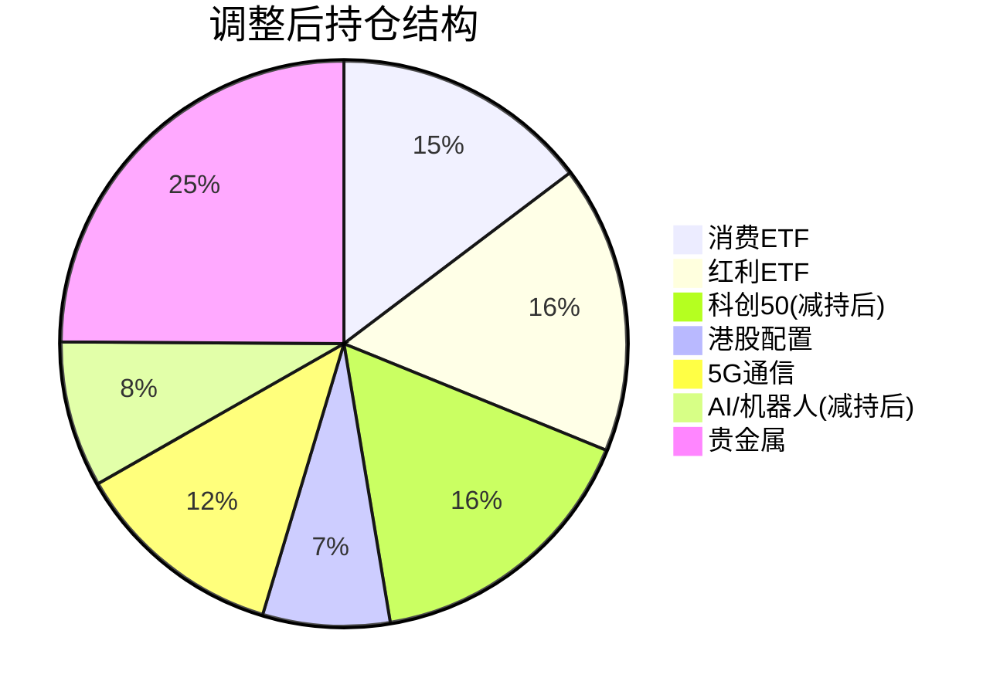

# 投资分析报告

**生成时间**: 2026-01-13 09:07:44 (周一)

---

## 1. 市场概况与持仓分析

### 账户概况

| 项目         |         数值 |
| :----------- | -----------: |
| 总持仓市值   | 23,399.10 元 |
| 持仓品种数   |        10 只 |
| 增量资金限制 |  ≤ 10,000 元 |

### 现有持仓技术诊断

整体来看，市场处于**强势上涨周期**，**7只标的处于RSI超买或临界区域**（≥66），需要警惕回调风险。

| 代码       | 名称         |      价格 |      RSI | 趋势     | 5日涨幅 | 20日涨幅 |   盈亏% | 诊断           |
| :--------- | :----------- | --------: | -------: | :------- | ------: | -------: | ------: | :------------- |
| 510150     | 消费ETF      |     0.577 |     64.9 | 强势上涨 |  +1.76% |   +3.78% |  +0.33% | ✅ 健康持有     |
| 510880     | 红利ETF      |     3.231 |     58.8 | 强势上涨 |  +1.60% |   +2.41% |  +0.80% | ✅ 健康持有     |
| 513180     | 恒指科技     |     0.772 |     58.3 | 强势上涨 |  +1.71% |   +4.04% |  +0.44% | ✅ 健康持有     |
| 513630     | 香港红利     |     1.614 |     46.5 | 上涨     |  +1.06% |   -0.55% |  -0.25% | ✅ 健康持有     |
| 515050     | 5GETF        |     2.381 |     66.5 | 强势上涨 |  +2.28% |   +9.07% |  +2.63% | ⚠️ 观察持有     |
| **515070** | **AI智能**   | **2.159** | **78.6** | 强势上涨 |  +7.68% |  +14.17% |  +8.44% | 🔴 **严重超买** |
| **588000** | **科创50**   | **1.594** | **77.2** | 强势上涨 |  +7.78% |  +14.51% | +25.96% | 🔴 **严重超买** |
| **159770** | **机器人AI** | **1.133** | **76.6** | 强势上涨 |  +5.49% |  +14.56% |  +6.04% | 🔴 **严重超买** |
| 159830     | 上海金       |    10.190 |     66.1 | 强势上涨 |  +3.03% |   +7.33% |  +4.81% | ⚠️ 观察持有     |
| 161226     | 白银基金     |     2.710 |     64.1 | 震荡     | +14.25% |  +39.91% | +25.87% | ⚠️ 涨幅巨大     |

> [!NOTE]
> **RSI 参考标准**: RSI < 30 超卖区，RSI > 76 严重超买区（今日调整阈值），30-66 健康区间

---

## 2. 历史策略复盘（1月7日、9日、12日）

### 复盘结果汇总

| 日期 | 品种            | 建议     | 建议价格 | 今日价格 | 涨跌幅 | 效果       |
| :--- | :-------------- | :------- | -------: | -------: | -----: | :--------- |
| 1/7  | 159241 航空航天 | 观望超买 |    1.453 |    1.718 | +18.2% | ⚠️ 错过上涨 |
| 1/7  | 159516 半导体   | 减持     |    1.820 |    1.823 |  +0.2% | ✅ 中性     |
| 1/9  | 159516 半导体   | 清仓     |    1.800 |    1.823 |  +1.3% | ✅ 中性     |
| 1/9  | 588000 科创50   | 减持     |    1.554 |    1.594 |  +2.6% | ✅ 中性     |
| 1/12 | 510150 消费     | 买入     |    0.577 |    0.577 |   0.0% | ✅ 中性     |
| 1/12 | 512400 有色     | 清仓     |    2.118 |    2.118 |   0.0% | ✅ 中性     |

**复盘发现**：
- 航空航天/军工 RSI 严重超买建议**持续有效**，虽短期涨幅继续但追高风险极大
- 半导体设备建议清仓后横盘，避免了回调风险
- 消费ETF建仓决策正确，估值合理趋势健康

### 风控阈值动态调整

基于复盘结果，今日采用**收紧5%**的风控策略：

| 阈值        | 基准值 |  今日调整 |
| :---------- | -----: | --------: |
| RSI超买     |     70 |    **66** |
| RSI严重超买 |     80 |    **76** |
| 止损线      |    -8% | **-7.6%** |

---

## 3. 非持仓品种建仓可行性

> [!CAUTION]
> **当前时点不建议追高！** 7个候选品种中，3个严重超买（RSI>76），4个超买区（RSI>66），无合适建仓标的。

| 代码       | 名称        |  价格 |      RSI | 5日涨幅 | 20日涨幅 | 可行性   | 建议           |
| :--------- | :---------- | ----: | -------: | ------: | -------: | :------- | :------------- |
| **159241** | 航空航天ETF | 1.718 | **90.2** |  +22.0% |   +42.2% | ❌ 不推荐 | 等RSI<61再建仓 |
| **512660** | 军工ETF     | 1.682 | **90.0** |  +19.5% |   +37.9% | ❌ 不推荐 | 等RSI<61再建仓 |
| **159516** | 半导体设备  | 1.823 | **79.0** |  +11.5% |   +24.0% | ❌ 不推荐 | 等RSI<61再建仓 |
| 159352     | A500ETF南方 | 1.307 |     75.2 |   +3.2% |    +8.3% | ⚠️ 观望   | 等回调至1.20   |
| 512400     | 有色金属ETF | 2.118 |     74.5 |   +6.9% |   +21.0% | ⚠️ 观望   | 等回调至1.95   |
| 159326     | 电网设备ETF | 1.591 |     71.3 |   +5.5% |   +10.9% | ⚠️ 观望   | 等回调至1.46   |
| 518880     | 黄金ETF     | 9.777 |     66.3 |   +3.0% |    +7.3% | ⚠️ 观望   | 等回调至9.00   |

---

## 4. 具体操作建议

> [!IMPORTANT]
> **策略核心：止盈锁定超买标的利润，持币观望等待回调机会**

### 🔴 减仓/卖出（回笼约 3,744 元）

| 代码       | 名称     | 操作 | 卖出价格区间 | 卖出数量 |  预估金额 | 理由                        |
| :--------- | :------- | :--- | :----------: | -------: | --------: | :-------------------------- |
| **515070** | AI智能   | 减持 | 2.12 - 2.20  |   100 股 |   ~216 元 | RSI=78.6 严重超买，盈利8.4% |
| **588000** | 科创50   | 减持 | 1.56 - 1.63  | 2,000 股 | ~3,188 元 | RSI=77.2 严重超买，盈利26%  |
| **159770** | 机器人AI | 减持 | 1.11 - 1.16  |   300 股 |   ~340 元 | RSI=76.6 严重超买，盈利6%   |

**合计回笼**: 约 3,744 元

### 🟢 建仓/增持

| 代码 | 名称 | 操作     | 理由                                   |
| :--- | :--- | :------- | :------------------------------------- |
| -    | -    | **暂无** | 候选品种均处于超买区，等待回调后再建仓 |

> [!TIP]
> **埋伏策略（条件单）**：
> - 航空航天 159241：价格回调至 **1.40-1.50** 且 RSI<65 时建仓 1,000股
> - 军工 512660：价格回调至 **1.40-1.50** 且 RSI<65 时建仓 1,000股
> - 黄金 518880：价格回调至 **9.00** 附近可建仓 400股

### ⏸️ 持仓留存

| 代码   | 名称     | 操作     | 理由                        |
| :----- | :------- | :------- | :-------------------------- |
| 510150 | 消费ETF  | 持有     | RSI=64.9 健康，强势上涨趋势 |
| 510880 | 红利ETF  | 持有     | RSI=58.8 健康，防守型配置   |
| 513180 | 恒指科技 | 持有     | RSI=58.3 健康，趋势转强     |
| 513630 | 香港红利 | 持有     | RSI=46.5 偏低，分散配置     |
| 515050 | 5GETF    | 观察持有 | RSI=66.5 临界，需关注       |
| 159830 | 上海金   | 观察持有 | RSI=66.1 临界，避险配置     |
| 161226 | 白银基金 | 持有     | RSI=64.1 健康，涨幅已大     |

---

## 5. 调整后展望

### 资金变化预估

| 项目       |    调整前 |     调整后 |             变化 |
| :--------- | --------: | ---------: | ---------------: |
| 持仓市值   | 23,399 元 | ~19,655 元 |        -3,744 元 |
| 可用资金   |         - |  +3,744 元 |                - |
| **净增仓** |         - |   **0 元** | ✅ 符合≤1万元限制 |

### 持仓结构变化

### 风险提示

> [!WARNING]
> 1. **大盘整体偏高**：多数持仓RSI>60，短期累积涨幅大，系统性回调风险上升
> 2. **航空航天/军工极端超买**：RSI>90，追高极可能面临15-20%回调
> 3. **科创50仍需关注**：减持后仍持2,000股，占比约16%

### 止损止盈位

| 代码   | 名称            |   建议止盈 |    建议止损 |
| :----- | :-------------- | ---------: | ----------: |
| 510150 | 消费ETF         | 0.62 (+8%) |  0.53 (-8%) |
| 515070 | AI智能 (减后)   | 2.30 (+7%) | 1.87 (-13%) |
| 588000 | 科创50 (减后)   | 1.72 (+8%) | 1.43 (-10%) |
| 159770 | 机器人AI (减后) | 1.22 (+8%) | 1.02 (-10%) |

---

## 6. 生成文件

- [analyze_portfolio.py](file:///Users/liupengcheng/Documents/Code/finance-analysis/quantitative-trading-skills/quantitative-trading/workspace/2026-01-13/090418/analyze_portfolio.py) - 分析脚本
- [analysis_result.json](file:///Users/liupengcheng/Documents/Code/finance-analysis/quantitative-trading-skills/quantitative-trading/workspace/2026-01-13/090418/analysis_result.json) - 技术指标数据

---

*注：以上分析基于技术指标与定量策略，仅供参考，不构成投资建议。市场有风险，投资需谨慎。*
